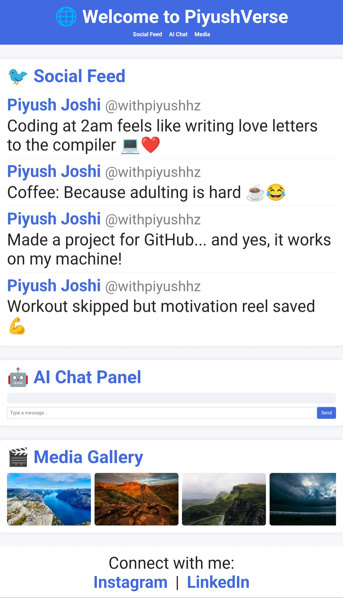

# 🌐 PiyushVerse

**PiyushVerse** is a flagship-level, all-in-one web experience built in a single HTML file using HTML, CSS, and JavaScript.  
It combines a **Landing Page**, **Social Feed**, **AI Chat Panel**, and **Media Gallery** — all with a modern royal blue theme and animations.  

---

## ✨ Features
- **Royal Blue Theme** for a professional look
- **Flying "Designed by Piyush" Animation**
- **🐦 Social Feed** — Dummy funny & relatable tweets
- **🤖 AI Chat Panel** — Jarvis-style dummy chat responses
- **🎬 Media Gallery** — Netflix-style horizontal scroll
- **Responsive Design** — Works perfectly on mobile & desktop
- Footer with clickable **Instagram** & **LinkedIn** links

---

## 🖼 Preview
 <!-- Optional: Add screenshot after upload -->

---

## 🚀 How to Use
1. Download `piyushverse.html` from this repository.
2. Open it in any browser to preview the project.
3. Upload it to GitHub Pages or any hosting platform to share.

---

## 🔗 Connect with Me
- **Instagram:** [@withpiyushhz](https://instagram.com/withpiyushhz)
- **LinkedIn:** [Piyush Joshi](https://www.linkedin.com/in/piyush2707/)

---

## 📜 License
This project is open-source and free to use for learning and portfolio purposes.
